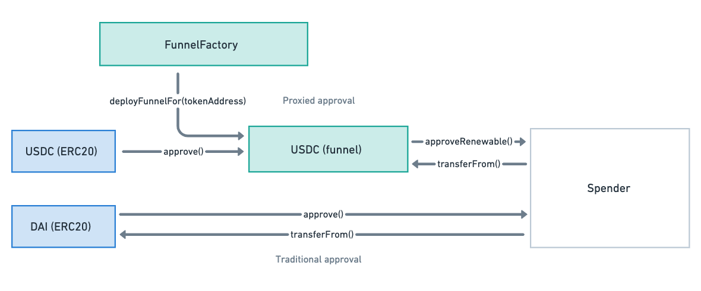

# Funnels

Funnels are contracts that enforces renewable token allowances [EIP-5827](https://eips.ethereum.org/EIPS/eip-5827) on existing ERC20 tokens, they help rate-limit the amount of tokens that can be transferred in a given time period.

Each funnel contract is a proxy/wrapper for an underlying ERC20 token, funneling a large unlimited allowance to a limited allowance that regains over time. For example, USDC will have its own funnel contract proxy, while another token like WETH will have its own funnel contract.



## How does it work?

By using this funnel contract, a sender can approve a spender a spending limit every periodic interval. For example, a subscriber can approve a merchant to deduct up to 100 USDC from his account every month.

1. User first approves the funnel contract to spend using ERC20 approvals
2. User can set renewable allowance on the funnel contract for a given period for an address (spender), approving up to a max limit with a recovery rate.
3. The spender can then withdraw money out of the user's account up to the available allowance on the account.

What is recovery rate? Recovery rate (amount per second) specifies the rate at which the allowance recovers over time. Once a spender spends the money, the available balance first decreases and slowly restores back to the max limit. Unlike conventional finance apps which performs discrete "resets" of spending limit, we implement renewable allowance using a continuous `recoveryRate` as it allows for more flexible usecases no bound by reset cycles and can be implemented more simply.

## Factory

The funnel factory is a contract that deploys new funnel contracts, it is the only contract that can create new funnels.

Goal is to deploy a factory onto all supported chains at the same address, and **every chain will produce the same funnel address for the same token address**.

## Contracts

### FunnelFactory.sol - Factory contract for creating funnels

`deployFunnelForToken(address _tokenAddress)` - Deploys the funnel contract for a given token address

`getFunnelForToken(address _tokenAddress)` - Returns the funnel contract address for a given token address

`isFunnel(address _funnelAddress)` - Returns true if the funnel contract is a funnel deployed by the factory.

### Funnel.sol - Funnel contract for ERC20 tokens

`baseToken()` - Returns the address of the underlying token

# Usage

## Testing

Our tests consist of both Foundry tests and hardhat tests. 

`forge test` - Runs the Foundry tests. Forge gas snapshots will be captured under `.forge-snapshots`

`npx hardhat test` - Runs hardhat tests

`npm test` - Runs all tests

## Deployment

Make copy of `.env.template` to `.env` and fill in the values.

Running local fork
`anvil`

Deploy to local fork

`forge script script/FunnelFactoryDeployer.sol:FunnelFactoryDeployer --fork-url http://localhost:8545 --broadcast`

Deploy factory to goerli

`forge script script/FunnelFactoryDeployer.sol:FunnelFactoryDeployer --rpc-url $GOERLI_RPC_URL --broadcast --verify --etherscan-api-key $ETHERSCAN_API_KEY`

Note: Deployment addresses are dependent on deployer's private key, FunnelFactory bytecode and salt used. Multiple deployments will fail.

## Misc

Run prettier to format the code

```sh
npx prettier --write 'src/**/*.sol'
```

### Gas Report

Forge snapshot automatically captures selected function calls on `.forge-snapshots`. To generate a more comprehensive report, run:

```sh
forge test --gas-report >> .forge-snapshots/report.txt   
forge snapshot # needed for gas checks
```

### Test Coverage

```sh
forge coverage --report lcov   
genhtml lcov.info -o report --branch-coverage 
```

# Deployments

| Network | Contract      | Address                                    |
| ------- | ------------- | ------------------------------------------ |
| Goerli  | Funnel (impl) | 0x3B1bbB0756250Bd981EEC8C02801d06ad5F86B75 |
| Goerli  | FunnelFactory | 0xDd3e9D430D0681Eaa833DbD6B186E7f031f71837 |
| Goerli  | USDC (funnel) | 0x3d5499808F8082d239a62B5c4876B6ffD23526d5 |

# License

MIT @ 2022 Suberra
